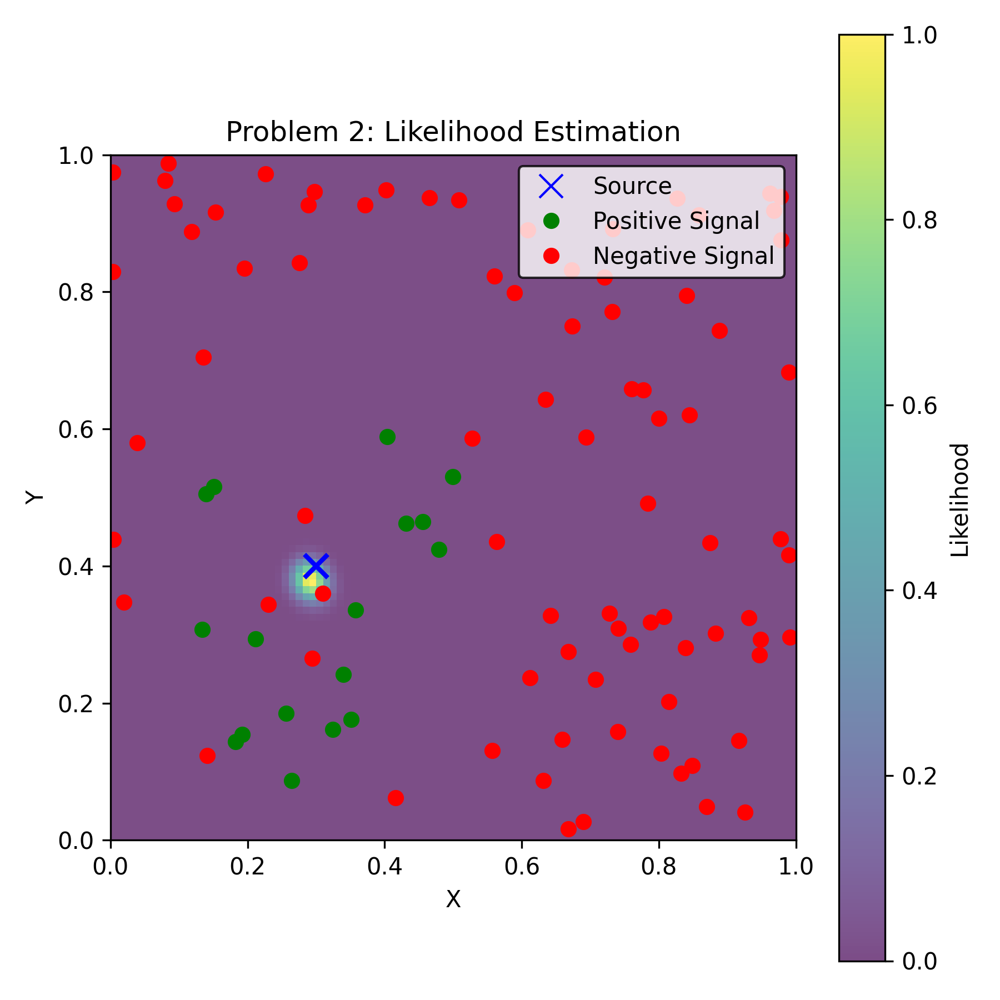
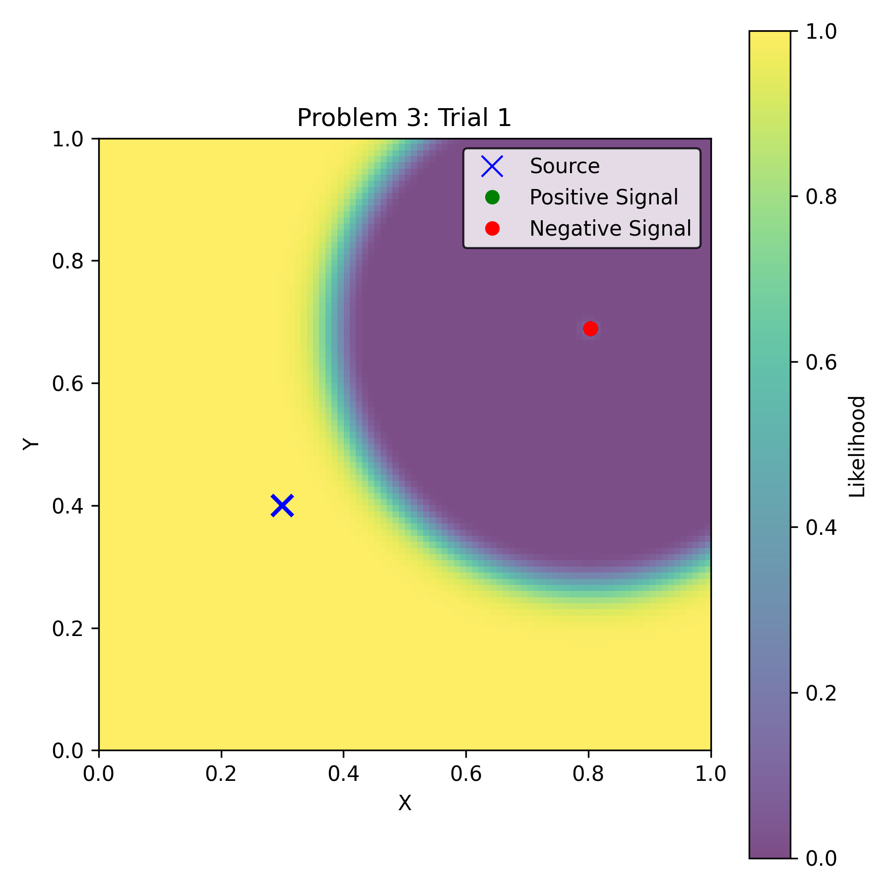
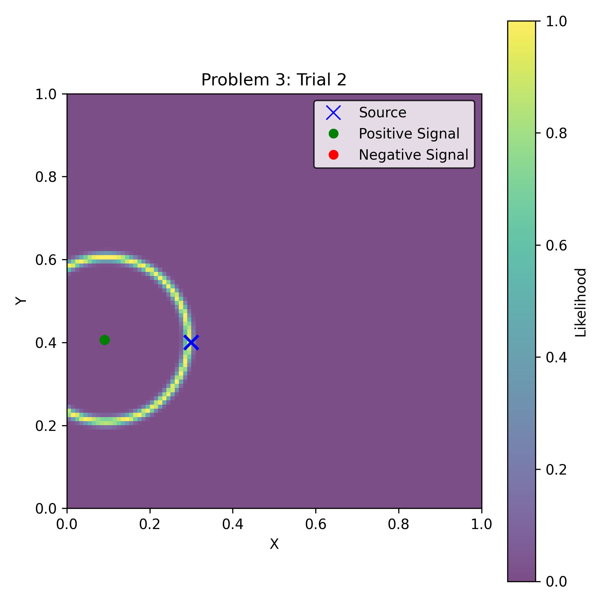
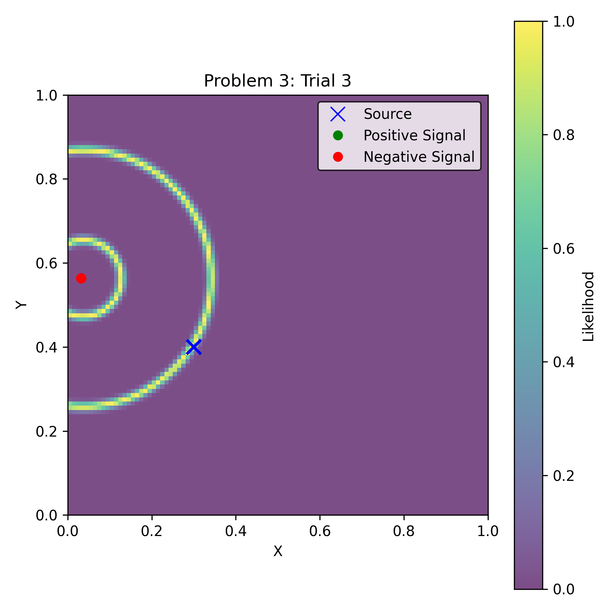
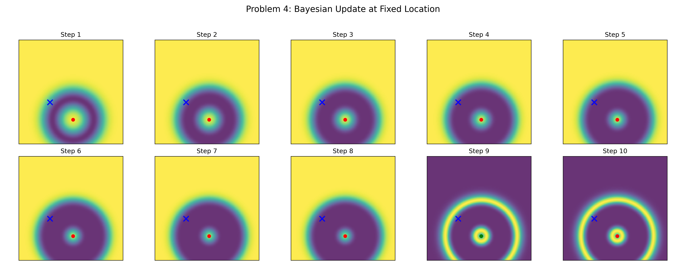
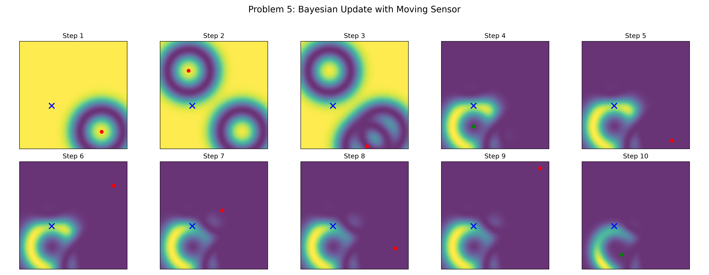

## ME 455 Homework 1 Xu Zhao
### Problem 1: Measurement visualization
This plot shows 100 sampled locations in the 2D space. The blue X is the true source location. Each point is either a green dot (positive signal) or a red dot (negative signal). The background shows the likelihood of getting a positive signal, forming a ring shape around the source.

### Problem 2: Likelihood Estimation Plot
This plot shows how likely each point in the space is to be the source, based on the 100 sensor measurements. The brighter (yellow) the area, the more likely it is the source. The blue X shows the real source location. Green and red dots show positive and negative signals.

### Problem 3: Fixed Location Trials
These three plots show the estimated source location using 100 measurements taken from the same sensor location in each trial. The sensor is fixed in each plot but the location is different for each trial. The green/red dots represent all the readings (stacked at one location). The blue X shows the true source.

### Problem 4: Sequential Bayesian Update at Fixed Location
This 2x5 grid shows how the belief of the source location changes after each of the 10 sensor readings from one fixed location. The blue X is the real source, and the green or red dot shows the sensor measurement (positive or negative). The background color reflects how confident the model is—the brighter, the more likely the source is there.

### Problem 5: Sequential Bayesian Update with Moving Sensor
This 2x5 grid shows how the belief of the source location updates over 10 steps as the sensor moves to a new random location each time. The blue X is the true source. Green dots show positive signals and red dots show negative signals. As more measurements come in, the belief becomes more focused on the true source.
