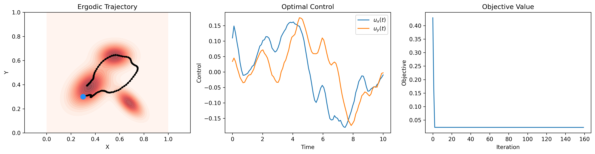
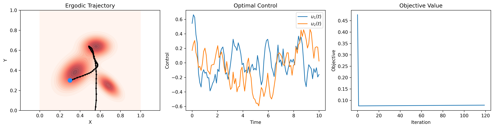
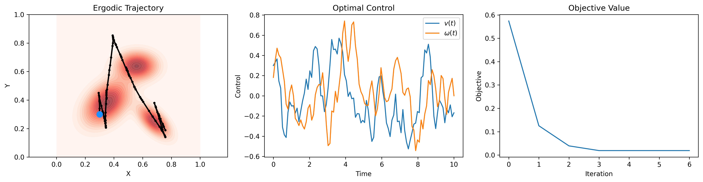

## ME 455 Homework 5 Xu Zhao

### Problem 1 – First-order System

The left panel overlays the converged trajectory (black dots and line) on the Gaussian-mixture search density; the path repeatedly sweeps high-probability regions, confirming spatial ergodicity.
The centre panel shows the optimal control inputs $u_x(t)$ and $u_y(t)$. Both remain smooth and low-amplitude, indicating gentle, energy-efficient motion.
The right panel plots the objective value versus iLQR iteration; the cost drops sharply during the first few updates and quickly plateaus near zero, evidencing rapid convergence.

### Problem 2 – Second-order System (Double Integrator)

The left panel again displays the trajectory over the target density, but the path is noticeably straighter at first and then turns sharply, reflecting the inertia inherent in a second-order model.
The centre panel contains the optimal acceleration controls $u_1(t)$ and $u_2(t)$. As expected for a double integrator, the signals show higher-frequency corrections to regulate both position and velocity.
The right panel shows the objective quickly collapsing to a small value within the first iteration and then flattening, demonstrating successful optimisation.

### Problem 3 – Differential-drive Robot

In the left plot the robot follows a piece-wise linear loop that sweeps the principal modes of the Gaussian mixture while honouring non-holonomic constraints.
The centre panel reports the forward velocity $v(t)$ and angular velocity $\omega(t)$. Notice the coupled bursts of steering and speed needed to pivot and realign with ergodic targets.
The right panel traces the objective value over six iLQR iterations; the cost decays monotonically and stabilises, indicating that the vehicle has reached an ergodic solution under its kinematic limits.

