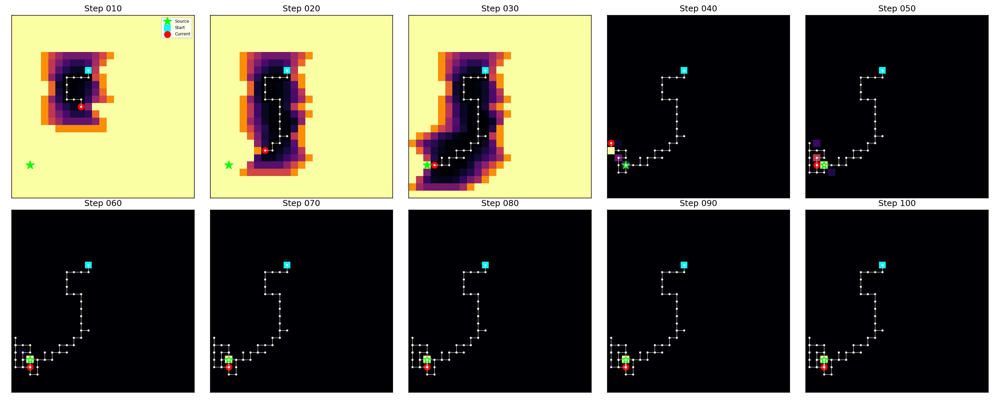
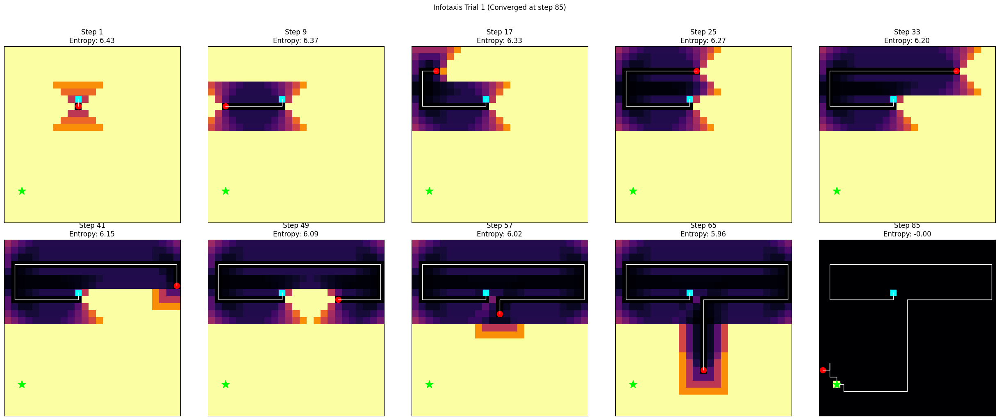
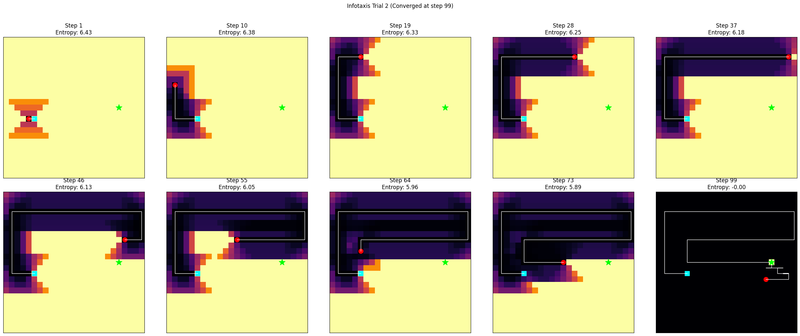
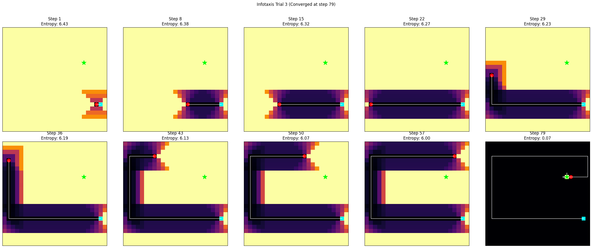

## ME 455 Homework 2 Xu Zhao
### Task 1: Exploration Strategy
The robot starts from a random location and uses an $\varepsilon$-greedy strategy with decaying $\varepsilon$ to balance exploration and exploitation. It prioritizes unvisited cells in early stages, then gradually moves towards the area with highest belief. The strategy avoids oscillation and leads to smooth convergence to the signal source.

### Task 2: Infotaxis Trials Summary
**Trial 1**
converged in 85 steps. The robot explored symmetrically and identified the source confidently.

**Trial 2**
converged in 99 steps. It initially focused on horizontal expansion before localizing the source at the upper-right corner.

**Trial 3** 
converged in 79 steps. The robot explored the left and bottom regions first before moving towards the central target. 

In all cases, entropy steadily decreased with clear belief map concentration, demonstrating the effectiveness of the Infotaxis strategy.

The results show that both exploration and information-driven strategies can localize the signal source effectively, but Infotaxis achieves faster convergence with structured search behavior.