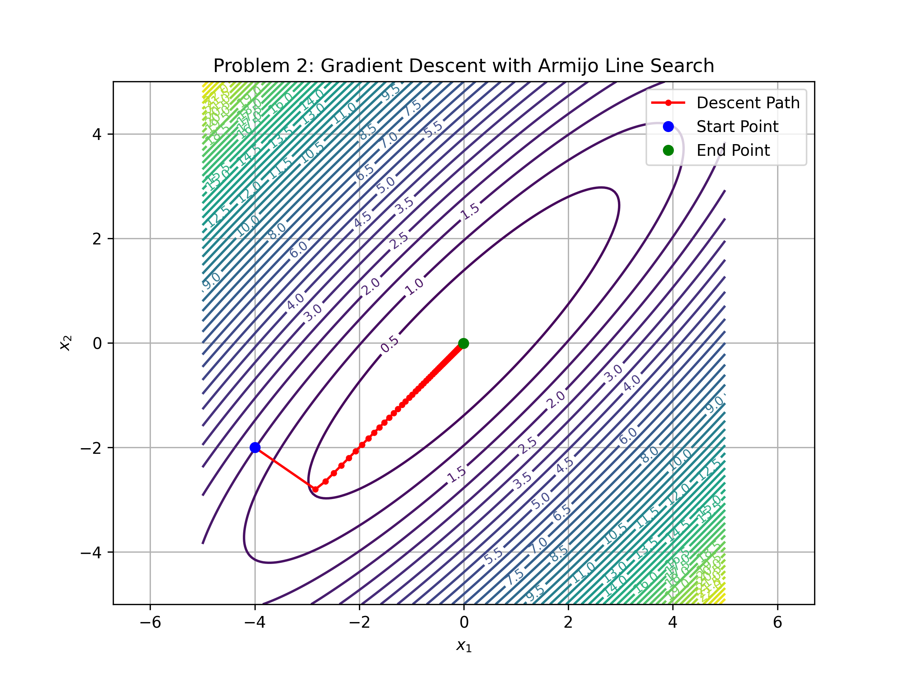
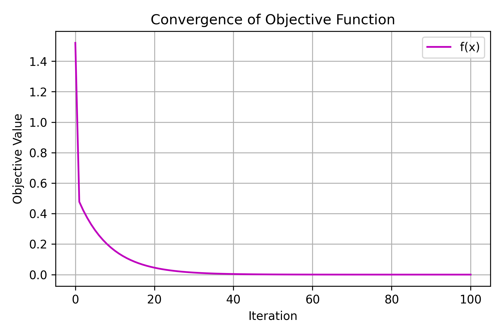
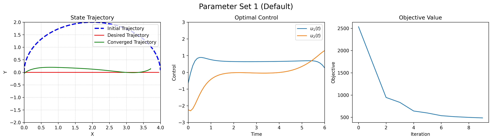
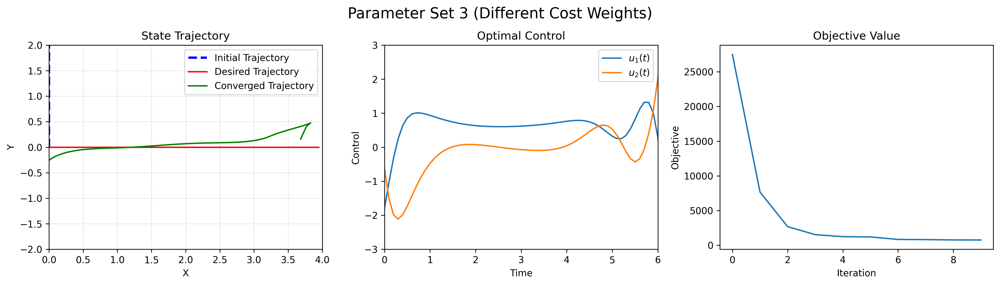

## ME 455 Homework 4 Xu Zhao

### Problem 1 Derivation

From equation (7), we have:
$$p(t)^T B(t) + b_v(t)^T = 0$$

This implies:
$$b_v(t)^T = -p(t)^T B(t)$$

Looking at the original definition of $b_u(t)$ from equation (5):
$$b_u(t) = D_2 l(x(t)^{[k]}, u(t)^{[k]})$$

The $b_v(t)$ term is different from $b_u(t)$. From equation (7), we can identify:
$$b_v(t) = -B(t)^T p(t)$$

For $a_z(t)$, looking at equation (8):
$$\dot{p}(t) = -A(t)^T p(t) - a_z(t)$$

Rearranging:
$$a_z(t) = -\dot{p}(t) - A(t)^T p(t)$$

Comparing with the original definition of $a_x(t)$ from equation (5):
$$a_x(t) = D_1 l(x(t)^{[k]}, u(t)^{[k]})$$

So $a_z(t)$ is equal to:
$$a_z(t) = D_1 l(x(t)^{[k]}, u(t)^{[k]})$$

From equations (7), (8), and (9), we have:
$$p(t)^T B(t) + b_v(t)^T = 0$$
$$\dot{p}(t) = -A(t)^T p(t) - a_z(t)$$
$$\dot{z}(t) = A(t)z(t) + B(t)v(t)$$

From equation (7), we can derive $v(t)$:
$$v(t) = -R_v^{-1}B(t)^T p(t)$$

Where $R_v$ is the weight matrix for the control (from equation (5)).

Substituting this into equation (9):
$$\dot{z}(t) = A(t)z(t) - B(t)R_v^{-1}B(t)^T p(t)$$

Now, we can express the two-point boundary value problem as:

$$\begin{bmatrix} \dot{z}(t) \\ \dot{p}(t) \end{bmatrix} = \begin{bmatrix} A(t) & -B(t)R_v^{-1}B(t)^T \\ -Q_z & -A(t)^T \end{bmatrix} \begin{bmatrix} z(t) \\ p(t) \end{bmatrix} + \begin{bmatrix} 0 \\ -a_z(t) \end{bmatrix}$$

Where $Q_z$ is the weight matrix for the state (from equation (5)).

Comparing with equation (11):
$$\begin{bmatrix} \dot{z}(t) \\ \dot{p}(t) \end{bmatrix} = \begin{bmatrix} M_{11} & M_{12} \\ M_{21} & M_{22} \end{bmatrix} \begin{bmatrix} z(t) \\ p(t) \end{bmatrix} + \begin{bmatrix} m_1 \\ m_2 \end{bmatrix}$$

We can identify:
$$M_{11} = A(t)$$
$$M_{12} = -B(t)R_v^{-1}B(t)^T$$
$$M_{21} = -Q_z$$
$$M_{22} = -A(t)^T$$

And:
$$m_1 = 0$$
$$m_2 = -a_z(t)$$

Once we've solved the two-point boundary value problem and obtained $z(t)$ and $p(t)$, we can calculate $v(t)$ using:

$$v(t) = -R_v^{-1}B(t)^T p(t)$$

This is derived directly from equation (7), where:
$$p(t)^T B(t) + b_v(t)^T = 0$$

Since $b_v(t)^T = v(t)^T R_v$ from equation (5), we have:
$$p(t)^T B(t) + v(t)^T R_v = 0$$

Solving for $v(t)$:
$$v(t) = -R_v^{-1}B(t)^T p(t)$$

**Answer**

1. $a_z(t) = D_1 l(x(t)^{[k]}, u(t)^{[k]})$

2. $b_v(t) = -B(t)^T p(t)$

3. Matrix $M = \begin{bmatrix} A(t) & -B(t)R_v^{-1}B(t)^T \\ -Q_z & -A(t)^T \end{bmatrix}$

4. Vector $m_1 = 0$

5. Vector $m_2 = -a_z(t)$

6. $v(t) = -R_v^{-1}B(t)^T p(t)$

### Problem 2: Gradient descent with Armijo line search

In this problem, we minimize the quadratic objective function:

$f(x) = 0.26(x_1^2 + x_2^2) - 0.46 x_1 x_2$

using gradient descent with Armijo line search. The optimization was performed with the following settings:

- Initial point: $x^{(0)} = [-4,\ -2]$
- Step size parameters:
  - $\gamma_0 = 1.0$ (initial step size)
  - $\alpha = 10^{-4}$ (sufficient decrease condition)
  - $\beta = 0.5$ (step size reduction factor)
- Number of iterations: 100

The plot below shows the trajectory of the iterates overlaid on the contour map of the objective function.

- The red line indicates the optimization path.
- The blue dot marks the starting point $[-4, -2]$.
- The green dot marks the final point after convergence.

The second plot displays the convergence of the function value $f(x)$ over the 100 iterations. The curve shows a monotonic decrease of the objective, confirming stable convergence.

### Problem 3: iLQR for Differential Drive Vehicle

I applied iLQR to a differential drive vehicle for a length of time $T = 2\pi$ seconds to track the desired trajectory $(x_d(t), y_d(t), \theta_d(t)) = (4t/2\pi, 0, \pi/2)$ subject to the dynamics:

$$\begin{bmatrix} \dot{x} \\ \dot{y} \\ \dot{\theta} \end{bmatrix} = \begin{bmatrix} \cos(\theta)u_1 \\ \sin(\theta)u_1 \\ u_2 \end{bmatrix}, \quad (x(0), y(0), \theta(0)) = (0, 0, \pi/2)$$

#### Parameter Set 1 (Default)

For the first parameter set, I used the default parameters with the initial control trajectory set to $[1.0, -0.5]$ for the entire horizon. 

The cost function weights were set to:

- $Q_x = \text{diag}([95.0, 10.0, 2.0])$ for state cost
- $R_u = \text{diag}([4.0, 2.0])$ for control cost
- $P1 = \text{diag}([20.0, 20.0, 5.0])$ for terminal state cost

The figure shows three plots:

1. State Trajectory: The initial trajectory (blue dashed line) starts at the origin and makes a large curve, while the converged trajectory (green solid line) stays much closer to the desired trajectory (red line).
2. Optimal Control: The control inputs $u_1(t)$ and $u_2(t)$ are well-behaved and stay within reasonable bounds.
3. Objective Value: The cost function decreases rapidly in the first iterations and converges smoothly.

#### Parameter Set 2 (Different Initial Control)

For the second set, I changed the initial control trajectory to $[0.5, 0.2]$, keeping other parameters the same.

This parameter set leads to:

1. State Trajectory: The converged trajectory shows a more pronounced deviation in the y-direction compared to the first parameter set.
2. Optimal Control: The control signals show more dramatic changes, especially around the middle of the trajectory.
3. Objective Value: The initial objective value is much higher, but the convergence pattern is similar.

#### Parameter Set 3 (Different Cost Weights)

For the third set, I modified the cost weights to:

- $Q_x = \text{diag}([50.0, 20.0, 5.0])$
- $R_u = \text{diag}([2.0, 1.0])$
- $P1 = \text{diag}([30.0, 30.0, 10.0])$

And set the initial control to $[0.8, 0.0]$.

The results show:

1. State Trajectory: The converged trajectory has a different shape with more gradual changes.
2. Optimal Control: The control inputs show more oscillatory behavior near the end of the trajectory.
3. Objective Value: Despite different weights, the optimization still converges effectively.

**Analysis**

The experiment with different parameter sets demonstrates the sensitivity of the iLQR algorithm to initial conditions and cost function weights. The algorithm successfully converges in all cases, but the resulting trajectories and control signals differ significantly. This highlights the importance of parameter tuning in optimal control problems.
