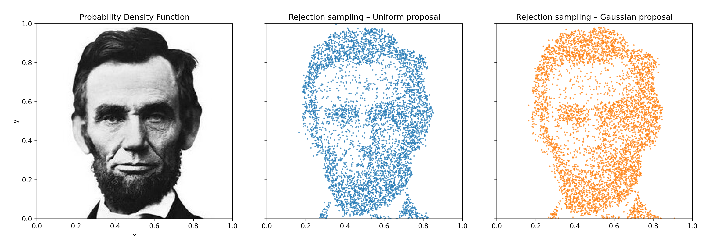
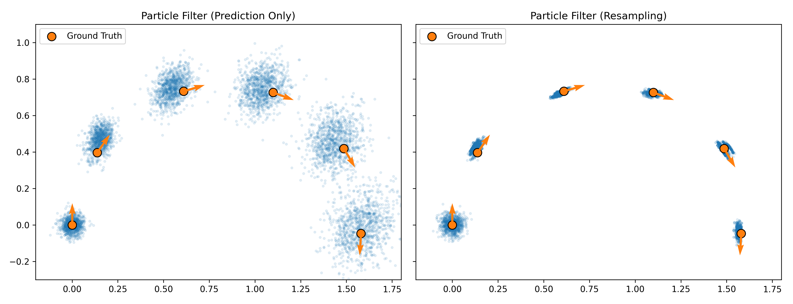

## ME 455 Homework 3 Xu Zhao
### Problem 1: Rejection Sampling
The left panel shows the constructed probability density function where darker regions represent higher density.
The center and right panels show 5000 accepted samples using a uniform proposal and a truncated Gaussian proposal, respectively.

Both methods successfully recover the underlying facial structure of the target distribution, with the Gaussian proposal being more concentrated around the high-probability regions. 

### Problem 2: Particle Filter – 1D Projection
Orange circles represent ground truth robot poses at six selected time steps, with arrowheads indicating the true heading.

Left: without measurement updates, the particle cloud grows and drifts over time. \
Right: with measurement updates and resampling, particles remain concentrated around the true trajectory, demonstrating improved accuracy and stability.

